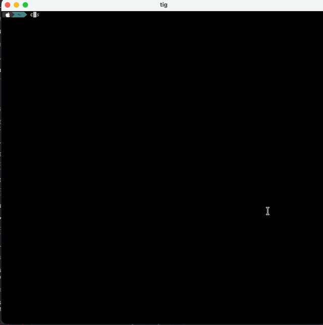

**One binary. Every prompt. JSON out. Go home.**

A `clet` is a CLI-let - Simple CLI commands that prompt the user with rich TUI (full mouse/keyboard), typed inputs, consistent JSON output and exit codes.

Works for humans and AI agents alike.

## Available Clets

| Alias | Description | Options |
| --- | --- | --- |
| `select` | Presents a list of options and returns the text of the selected item. | `--options`, `args...` |
| `text` | Prompts for free-form text input and returns the entered string. | |
| `multiline-text`, `mt` | Prompts for multi-line text input and returns the entered string. | |
| `int` | Prompts for an integer value using a numeric spinner. | `--step` |
| `decimal` | Prompts for a decimal value using a numeric spinner. | `--step` |
| `confirm` | Prompts for a yes/no confirmation and returns a boolean. | `--prompt` |
| `date` | Prompts for a date and returns an ISO-8601 date string (YYYY-MM-DD). | |
| `time` | Prompts for a time and returns an ISO-8601 time string (HH:MM:SS). | |
| `duration` | Prompts for a duration and returns an ISO-8601 duration string (e.g. PT1H30M). | |
| `color` | Prompts for a color and returns a hex string (#rrggbb). | |
| `multi-select` | Presents a list of options with checkboxes and returns the selected texts. | `--options`, `args...` |
| `attribute-picker`, `attribute` | Prompts for text attributes (foreground, background, style) and returns a JSON object. | |
| `pick-file`, `file` | Opens a file picker dialog and returns the selected file path(s). | `--multi`, `--root`, `--filter` |
| `pick-directory`, `dir` | Opens a directory picker dialog and returns the selected directory path. | `--root` |
| `linear-range`, `range` | Presents a linear range selector (single, multi, or bounded range) over labelled options. | `--mode`, `--options`, `--range-kind`, `args...` |
| `md`, `markdown` | Browse and render Markdown files with link navigation and syntax highlighting. | `--theme`, `--cat`, `--no-browse`, `args...` |
| `edit`, `editor` | Opens a full-screen text editor for files or piped content. | `args...` |
| `config` | Edit the clet configuration file (`~/.tui/clet.config.json`). | |

## Install

### Release (not available until v1.0 is released)

```sh
brew install gui-cs/tap/clet  # macOS / Linux
winget install gui-cs.clet    # Windows 10/11
dotnet tool install -g clet   # any platform with .NET SDK
```

### Pre-Release

```sh
dotnet tool install -g clet --prerelease
```

> **Upgrading from a `-develop` build?** Develop prereleases are no longer published to NuGet. If you previously installed a `-develop` version, clear the NuGet cache before reinstalling:
> ```sh
> dotnet tool uninstall -g clet
> dotnet nuget locals http-cache --clear
> dotnet tool install -g clet --prerelease
> ```

> **zsh/bash users:** If `clet` isn't found after `dotnet tool install`, add the tools directory to your PATH:
> ```sh
> echo 'export PATH="$HOME/.dotnet/tools:$PATH"' >> ~/.zshrc  # or ~/.bashrc
> source ~/.zshrc
> ```
> PowerShell does this automatically; zsh and bash do not.

### Native binaries (direct download)

Standalone NativeAOT binaries (no .NET runtime required) are available for macOS, Linux, and Windows. See [full install instructions](#native-binaries-install) at the bottom of this file.

## What it replaces

| Task | Before `clet` | With `clet` |
|---|---|---|
| Prompt for a choice | `select` / `gum choose` / `fzf` | `clet select "prod" "staging" "dev"` |
| Pick a file | `gum file` (fuzzy filter) | `clet pick-file` (real tree dialog) |
| Confirm an action | `read -p "Sure? [y/N]"` | `clet confirm "Deploy to prod?"` |
| Render Markdown | `glow` / `bat` / `mdcat` | `clet md ./CHANGELOG.md` |
| Quick text editing | `nano` / `vi` / `micro` | `clet edit ./notes.txt` |
| Multiple tools, mismatched exit codes | `read` + `dialog` + `fzf` + `glow` | `clet` — one tool, one contract |

## Usage

### Human usage

```sh
# Pick from a list
clet select "prod" "staging" "dev"

# Pick a file from a tree dialog
clet pick-file --root ./src --title "Choose a source file"

# Confirm before a destructive action
clet confirm "This will delete 40k rows. Continue?"

# Render a Markdown file — full-screen, dismiss with q / Esc
clet md ./CHANGELOG.md

# Edit a file in the built-in editor
clet edit ./notes.txt

# Open the configuration editor (theming, keybindings, etc.)
clet config

# See all available clets
clet list
```

### AI agent usage (`--json`)

```sh
# Structured elicitation — agent gets a typed result, not raw text
clet select --json "prod" "staging" "dev"
# → {"schemaVersion":1,"status":"ok","value":"staging"}

# Pick a file with a timeout
clet pick-file --json --root ./src --timeout 30s
# → {"schemaVersion":1,"status":"ok","value":"src/User.ts"}

# Confirm an action
clet confirm --json "Apply this patch?"
# → {"schemaVersion":1,"status":"cancelled"}   (exit 130)

# Discover available clets once per session
clet list --json
# → {"schemaVersion":1,"clets":[{"alias":"select","kind":"input","resultType":"string",...},...]}
```

Exit codes: 

- `0` success
- `2` usage error
- `130` cancelled (SIGINT convention).

### Demo



## Alpha feedback

clet is in **friends-and-family alpha** ([milestone tracker](https://github.com/gui-cs/clet/issues/33)). If something doesn't work, looks wrong, or is just confusing, **[file an issue](https://github.com/gui-cs/clet/issues/new)**. Include:

- `clet --version` output (e.g. `1.0.0-alpha (Terminal.Gui 2.0.2-develop.37)`).
- Your terminal + OS (e.g. "Windows Terminal on Windows 11", "iTerm2 on macOS 15").
- What you ran, what you expected, what happened.

## FAQ

### Q: Why not just use `gum` (or `glow`, or `bat`, or `dialog`)?

Each of those is good at one thing. `clet` is the unification, with a real UI toolkit underneath. Every clet has full mouse support, configurable keybindings, themed colors, and one consistent navigation model. `clet pick-file` is Terminal.Gui's `FileDialog` — a real tree with sortable columns, extension filters, and breadcrumbs, not a fuzzy-filter over `find` output. And because inputs and viewers live in one tool, you get the same keys and colors whether you're picking a file or reading a Markdown document.

For a shell user who only needs `read`-with-validation, `gum` is fine. We are not competing for that user.

### Q: What's the difference between an input clet and a viewer clet?

- **Input clets** (`select`, `text`, `pick-file`, …) prompt for a value and return a typed result: exit 0, `{"schemaVersion":1,"status":"ok","value":…}`.
- **Browser clets** (`md`) render content with link navigation, back/forward history, and return on dismiss: exit 0, `{"schemaVersion":1,"status":"ok"}`.

Both share theming, keybindings, mouse support, and the JSON envelope.

### Q: What does the JSON output look like?

```json
{ "schemaVersion": 1, "status": "ok",      "value": "prod" }   // input selected
{ "schemaVersion": 1, "status": "ok" }                         // viewer dismissed
{ "schemaVersion": 1, "status": "cancelled" }                  // Esc / Ctrl-C (exit 130)
{ "schemaVersion": 1, "status": "error", "code": "validation", "message": "…" }
```

### Q: Exit codes?

- `0` success
- `1` no-result
- `2` usage error
- `130` cancelled (SIGINT convention).

### Q: Cancellation and timeouts?

Esc and Ctrl-C cancel input clets; `q`, Esc, and Ctrl-C dismiss viewer clets. `--timeout <duration>` (e.g. `--timeout 30s`) cancels automatically — useful for AI agent scripts.

### Q: Which clets ship in v1.0?

**Input (14):** `text`, `int`, `decimal`, `select`, `multi-select`, `confirm`, `pick-file`, `pick-directory`, `date`, `time`, `duration`, `color`, `attribute-picker`, `linear-range`

**Viewer (4):** `md` (Markdown browser with link navigation, back/forward history, and syntax highlighting), `edit` (full-screen text editor), `config` (configuration editor for `~/.tui/clet.config.json`), `help`

Run `clet list` to see what's available in your installed version.

### Q: Theming?

Every clet inherits the active Terminal.Gui theme automatically. To customize, create `~/.tui/clet.config.json`:

```json
{
  "Theme": "MyTheme",
  "Themes": {
    "MyTheme": {
      "ColorSchemes": {
        "Base": {
          "Normal":    { "Foreground": "#E0E0E0", "Background": "#1E1E1E" },
          "Focus":     { "Foreground": "#FFFFFF", "Background": "#264F78" },
          "HotNormal": { "Foreground": "#569CD6", "Background": "#1E1E1E" },
          "HotFocus":  { "Foreground": "#9CDCFE", "Background": "#264F78" }
        }
      }
    }
  }
}
```

Or, you can pick from a built-in Terminal.Gui Theme. This example picks the `Anders` theme, a nod to [Anders Heilsberg](https://www.microsoft.com/en-us/behind-the-tech/anders-hejlsberg-a-craftsman-of-computer-language) who created TurboPascal. 

```json
{
  "Theme": "Anders"
}
```


All clets render with the `Base` color scheme, so customizing `Base` controls every clet's appearance. See the [Terminal.Gui Configuration docs](https://gui-cs.github.io/Terminal.Gui/docs/configuration.html) for the full schema.

### Q: Key bindings?

Key bindings are also configured via `~/.tui/clet.config.json`:

```json
{
  "Key.Bindings": {
    "Application.QuitKey": "Ctrl+Q"
  }
}
```

This changes the quit/dismiss key for all clets. `clet md` shows the active quit key in the status bar automatically.

### Q: Do I need .NET installed?

**No** - for `brew install`, `winget install`, and the [direct-download native binaries](#native-binaries-install) on the GitHub Releases page — all three ship a self-contained NativeAOT binary (~8 MB, no runtime needed). The direct-download binaries are *not yet code-signed*; the `brew` and `winget` channels stay signed.

**Yes** - for `dotnet tool install -g clet`.

### Q: What's the `--prerelease` channel?

Releases from `main` publish prerelease packages to NuGet (versioned `1.x.y-alpha.N` during alpha, then `-beta.N`, `-rc.N`). Stable users see no churn — `dotnet tool install -g clet` still resolves to the latest non-prerelease, and `brew`/`winget` only ship stable main releases. If you want the bleeding edge, pass `--prerelease`.

### Q: How do I report a bug or give feedback during alpha?

[File an issue](https://github.com/gui-cs/clet/issues/new). That's the only feedback channel — no Discussions, no forum. See the [Alpha feedback](#alpha-feedback) section above for what to include.

## Native binaries install

Every [GitHub release](https://github.com/gui-cs/clet/releases) ships standalone NativeAOT binaries for the three primary platforms. **No .NET runtime required** — single-file executable, ~20 MB, cold-start in tens of milliseconds.

| Platform | Asset |
|---|---|
| macOS (Apple Silicon) | `clet-<version>-osx-arm64.tar.gz` |
| Linux x64 | `clet-<version>-linux-x64.tar.gz` |
| Windows x64 | `clet-<version>-win-x64.zip` |

> **Not yet code-signed.** Apple/Windows code signing is deferred until after v1.0. macOS Gatekeeper will quarantine the binary on first run, and Windows SmartScreen may warn. If you don't want to bypass those prompts, use `brew` / `winget` / `dotnet tool install` instead — those channels stay signed.

**macOS (Apple Silicon):**
```sh
# Replace <version> with the release tag, e.g. 1.0.0-develop.41
curl -LO https://github.com/gui-cs/clet/releases/latest/download/clet-<version>-osx-arm64.tar.gz
tar -xzf clet-<version>-osx-arm64.tar.gz
xattr -d com.apple.quarantine ./clet  # clear Gatekeeper quarantine
sudo mv clet /usr/local/bin/
clet --version
```

**Linux x64:**
```sh
curl -LO https://github.com/gui-cs/clet/releases/latest/download/clet-<version>-linux-x64.tar.gz
tar -xzf clet-<version>-linux-x64.tar.gz
chmod +x ./clet
sudo mv clet /usr/local/bin/
clet --version
```

**Windows x64 (PowerShell):**
```powershell
# Replace <version> with the release tag
Invoke-WebRequest -Uri "https://github.com/gui-cs/clet/releases/latest/download/clet-<version>-win-x64.zip" -OutFile clet.zip
Expand-Archive clet.zip -DestinationPath $env:USERPROFILE\bin\clet
# Add $env:USERPROFILE\bin\clet to your PATH, then:
clet --version
```

If SmartScreen blocks the download, click **More info → Run anyway**, or unblock the file with `Unblock-File .\clet.exe`.

### About `libonigwrap`

Each archive includes a native library (`libonigwrap.dylib` on macOS, `libonigwrap.so` on Linux, `onigwrap.dll` on Windows). This is the [Oniguruma](https://github.com/kkos/oniguruma) regex engine used by TextMateSharp for **syntax highlighting in code blocks** when viewing Markdown (`clet md`).

The `clet` binary runs fine without it — everything works except syntax highlighting in fenced code blocks will be plain text. If you want syntax highlighting, keep the library in the same directory as the `clet` binary. On macOS, clear its quarantine flag too:

```sh
xattr -d com.apple.quarantine ./libonigwrap.dylib
```

## Further reading

- [Demo scripts](demos/README.md) — runnable examples showing how to chain clets in scripts
- [Press release & customer voices](specs/press-release.md)
- [Implementation spec](specs/clet-spec.md)
