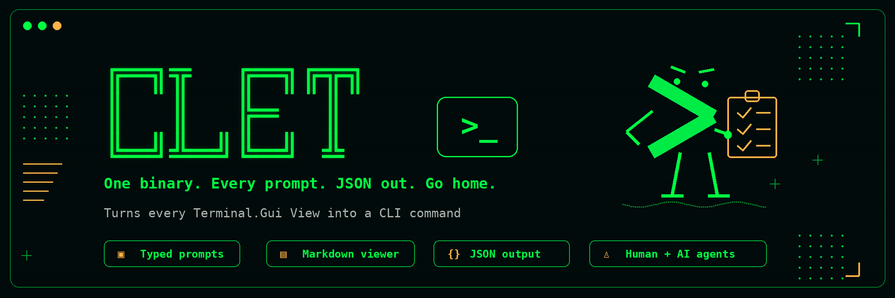

**One binary. Every prompt. JSON out. Go home.**

Turns every [Terminal.Gui](https://github.com/gui-cs/Terminal.Gui) View into a CLI command — typed inputs, a real file picker, a Markdown viewer — with consistent JSON output, predictable exit codes, and full keyboard/mouse support. Works for humans and AI agents alike.

## Install

### Release

```sh
brew install gui-cs/tap/clet  # macOS / Linux
winget install gui-cs.clet    # Windows 10/11
dotnet tool install -g clet   # any platform with .NET SDK
```

### Pre-Release

Tracks Terminal.Gui's `develop` channel — a new clet prerelease lands on NuGet for every TG develop publish.

```sh
dotnet tool install -g clet --prerelease
```

## What it replaces

| Task | Before `clet` | With `clet` |
|---|---|---|
| Prompt for a choice | `select` / `gum choose` / `fzf` | `clet select "prod" "staging" "dev"` |
| Pick a file | `gum file` (fuzzy filter) | `clet pick-file` (real tree dialog) |
| Confirm an action | `read -p "Sure? [y/N]"` | `clet confirm "Deploy to prod?"` |
| Render Markdown | `glow` / `bat` / `mdcat` | `clet md ./CHANGELOG.md` |
| Multiple tools, mismatched exit codes | `read` + `dialog` + `fzf` + `glow` | `clet` — one tool, one contract |

## Usage

### Human usage

```sh
# Pick from a list
clet select "prod" "staging" "dev"

# Pick a file from a tree dialog
clet pick-file --root ./src --title "Choose a source file"

# Confirm before a destructive action
clet confirm "This will delete 40k rows. Continue?"

# Render a Markdown file — full-screen, dismiss with q / Esc
clet md ./CHANGELOG.md

# See all available clets
clet list
```

### AI agent usage (`--json`)

```sh
# Structured elicitation — agent gets a typed result, not raw text
clet select --json "prod" "staging" "dev"
# → {"schemaVersion":1,"status":"ok","value":"staging"}

# Pick a file with a timeout
clet pick-file --json --root ./src --timeout 30s
# → {"schemaVersion":1,"status":"ok","value":"src/User.ts"}

# Confirm an action
clet confirm --json "Apply this patch?"
# → {"schemaVersion":1,"status":"cancelled"}   (exit 130)

# Discover available clets once per session
clet list --json
# → {"schemaVersion":1,"clets":[{"alias":"select","kind":"input","resultType":"string",...},...]}
```

Exit codes: 

- `0` success
- `2` usage error
- `130` cancelled (SIGINT convention).

### Demo

> 🎬 *Recording coming soon.*

Here's `clet file`


## Alpha feedback

clet is in **friends-and-family alpha** ([milestone tracker](https://github.com/gui-cs/clet/issues/33)). If something doesn't work, looks wrong, or is just confusing, **[file an issue](https://github.com/gui-cs/clet/issues/new)**. Include:

- `clet --version` output (e.g. `1.0.0-alpha (Terminal.Gui 2.0.2-develop.37)`).
- Your terminal + OS (e.g. "Windows Terminal on Windows 11", "iTerm2 on macOS 15").
- What you ran, what you expected, what happened.

## FAQ

### Q: Why not just use `gum` (or `glow`, or `bat`, or `dialog`)?

Each of those is good at one thing. `clet` is the unification, with a real UI toolkit underneath. Every clet has full mouse support, configurable keybindings, themed colors, and one consistent navigation model. `clet pick-file` is Terminal.Gui's `FileDialog` — a real tree with sortable columns, extension filters, and breadcrumbs, not a fuzzy-filter over `find` output. And because inputs and viewers live in one tool, you get the same keys and colors whether you're picking a file or reading a Markdown document.

For a shell user who only needs `read`-with-validation, `gum` is fine. We are not competing for that user.

### Q: What's the difference between an input clet and a viewer clet?

- **Input clets** (`select`, `text`, `pick-file`, …) prompt for a value and return a typed result: exit 0, `{"schemaVersion":1,"status":"ok","value":…}`.
- **Viewer clets** (`md`) render content for the user to read and return on dismiss: exit 0, `{"schemaVersion":1,"status":"ok"}`.

Both share theming, keybindings, mouse support, and the JSON envelope.

### Q: What does the JSON output look like?

```json
{ "schemaVersion": 1, "status": "ok",      "value": "prod" }   // input selected
{ "schemaVersion": 1, "status": "ok" }                         // viewer dismissed
{ "schemaVersion": 1, "status": "cancelled" }                  // Esc / Ctrl-C (exit 130)
{ "schemaVersion": 1, "status": "error", "code": "validation", "message": "…" }
```

### Q: Exit codes?

- `0` success
- `1` no-result
- `2` usage error
- `130` cancelled (SIGINT convention).

### Q: Cancellation and timeouts?

Esc and Ctrl-C cancel input clets; `q`, Esc, and Ctrl-C dismiss viewer clets. `--timeout <duration>` (e.g. `--timeout 30s`) cancels automatically — useful for AI agent scripts.

### Q: Which clets ship in v1.0?

**Input (14):** `text`, `int`, `decimal`, `select`, `multi-select`, `confirm`, `pick-file`, `pick-directory`, `date`, `time`, `duration`, `color`, `attribute-picker`, `range`

**Viewer (1):** `md` (Markdown via Terminal.Gui's built-in `Markdown` View)

Run `clet list` to see what's available in your installed version.

### Q: Theming?

Every clet inherits the active Terminal.Gui theme automatically. To customize, create `~/.tui/clet.config.json`:

```json
{
  "Theme": "MyTheme",
  "Themes": {
    "MyTheme": {
      "ColorSchemes": {
        "Base": {
          "Normal":    { "Foreground": "#E0E0E0", "Background": "#1E1E1E" },
          "Focus":     { "Foreground": "#FFFFFF", "Background": "#264F78" },
          "HotNormal": { "Foreground": "#569CD6", "Background": "#1E1E1E" },
          "HotFocus":  { "Foreground": "#9CDCFE", "Background": "#264F78" }
        }
      }
    }
  }
}
```

Or, you can pick from a built-in Terminal.Gui Theme. This example picks the `Anders` theme, a nod to [Anders Heilsberg](https://www.microsoft.com/en-us/behind-the-tech/anders-hejlsberg-a-craftsman-of-computer-language) who created TurboPascal. 

```json
{
  "Theme": "Anders"
}
```


All clets render with the `Base` color scheme, so customizing `Base` controls every clet's appearance. See the [Terminal.Gui Configuration docs](https://gui-cs.github.io/Terminal.Gui/docs/configuration.html) for the full schema.

### Q: Key bindings?

Key bindings are also configured via `~/.tui/clet.config.json`:

```json
{
  "Key.Bindings": {
    "Application.QuitKey": "Ctrl+Q"
  }
}
```

This changes the quit/dismiss key for all clets. `clet md` shows the active quit key in the status bar automatically.

### Q: Do I need .NET installed?

**No** - for `brew install` and `winget install` — those ship a self-contained NativeAOT binary (~8 MB, no runtime needed).

**Yes** - for `dotnet tool install -g clet`.

### Q: What's the `--prerelease` channel?

Every push to `develop` triggers a matching `clet` prerelease push to NuGet (versioned `1.x.y-develop.NN`). Stable users see no churn — `dotnet tool install -g clet` still resolves to the latest non-prerelease, and `brew`/`winget` only ship stable main releases. If you want the bleeding edge, pass `--prerelease`. 

### Q: How do I report a bug or give feedback during alpha?

[File an issue](https://github.com/gui-cs/clet/issues/new). That's the only feedback channel — no Discussions, no forum. See the [Alpha feedback](#alpha-feedback) section above for what to include.

## Further reading

- [Press release & customer voices](specs/press-release.md)
- [Implementation spec](specs/clet-spec.md)
